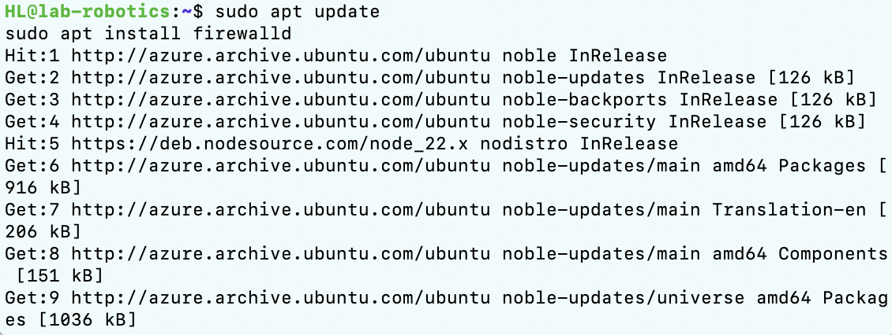
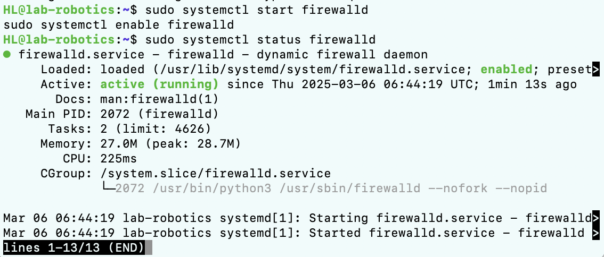
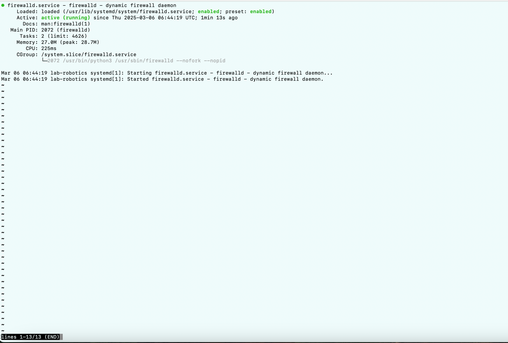
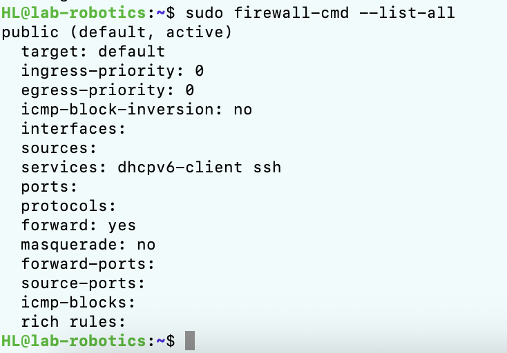
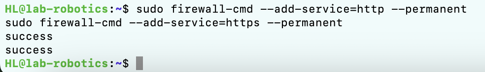
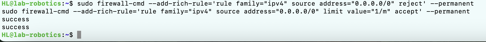

#  Linux Exercise
## Heli
## ICTrobotics BEIRP24A6
## 06032025
- Part 1: Create a firewall for your server that loads when the server starts. 
- Part 2:Openssh server
- Part 3: http and https server
- Part 4: Define the firewall so that all connections blocked by the firewall are logged
## Create a firewall for your server that loads when the server starts.
- Run the virtual machine and complete the link in the terminal and Install firewalld

Firewalld has been successfully started and enabled. The current status is active (running), which means that the firewall is running on the system and is set to start at boot.

This status is the output of the systemctl status command, which shows the status of the firewalld service. To exit this status and return to the command line, just press the q key.
## Openssh server

## http and https server

## Define the firewall so that all connections blocked by the firewall are logged
Enable SSH service and configure firewall logging: To ensure that all blocked connections are logged, you need to configure firewall logging. You can do this with the following command. The --set-log-denied option of firewall-cmd will cause errors when used with other options. To avoid this problem, I need to separate the two instructions.

Preventing SYN Flood Attacks
[run](810.jpg)
List firewall protections and restart the firewall

      

     

