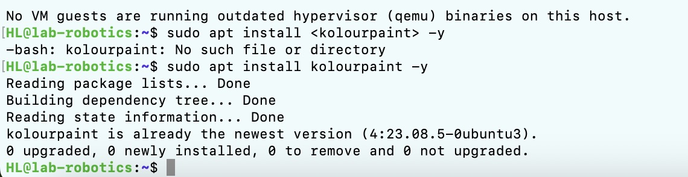
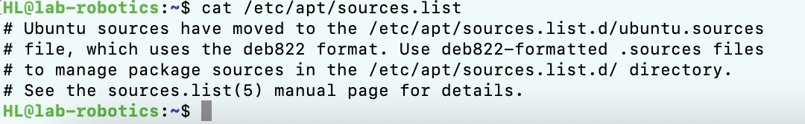

#  Linux Exercise
## Heli
## ICTrobotics BEIRP24A6
## 02122025
- Part 1: Understanding APT & System Updates 
- Part 2:Installing & Managing Packages
- Part 3: Removing & Cleaning Packages
- Part 4: Managing Repositories & Troubleshooting
## Specific steps and problems encountered
- Run the virtual machine and complete the link in the terminal

- Check APT version: apt --version ✅
Update package list: sudo apt update ✅
Upgrade installed packages: sudo apt upgrade -y ✅
Check whether there are packages to be upgraded: apt list --upgradable ✅

- instal kolourpaint

- Note that there are no other symbols in the input format

- Indicates that kolourpaint has been successfully installed and the version is 
4:23.08.5-0ubuntu3

- remove kolourpaint

remove: Only removes the package files, but retains the user's configuration files.
purge: Delete software package files and related configuration files for a more thorough cleanup
- Automatically clean up unused dependencies, which can free up disk space

- Clear downloaded package files stored in apt folder

different folder
- The command will enable the specified repository.
Refresh repository information

- Try installing a non-existent package
Unable to locate package fakepackage
use apt search fakepackage and try toConfirm repositories are enabled: Check if the necessary repositories are enabled in the file.
Refresh repository information

## Bonus Challenge

Prevent the trouble caused by unexpected updates

      

     

