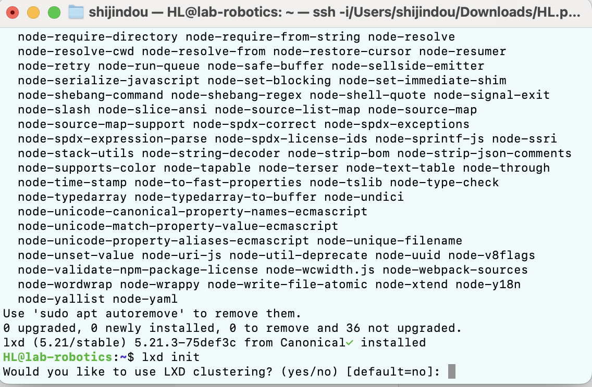

#  Linux Exercise
## Heli
## ICTrobotics BEIRP24A6
## 02202025
- Part 1: Introduction to virtualization concepts 
- Part 2: Working with Multipass 
- Part 3: Exploring LXD
- Part 4: How to Stick Apps with Docker
## part 1

In terms of architecture, a VM requires an independent operating system and its architecture is closer to physical machine virtualization.
A container does not include a complete OS but shares the host kernel, making it more lightweight.

In terms of resource utilization, a VM has a slower startup time, whereas a container starts quickly.
The resource overhead of a VM is higher than that of a container, and its storage consumption is also larger than that of a container.
VMs are suitable for long-running applications, while containers are better for deployment and building architectures.

In terms of isolation level, VMs provide stronger security and compatibility, making them suitable for cross-operating system applications.
Containers share the kernel, making their isolation weaker, but they are more lightweight and flexible.
## part 2 
 
Successfully installed Multipass.
 
My computer does not support virtualization, further action is required.

## part 3

Install lxd and run lxd initialization

      

     

