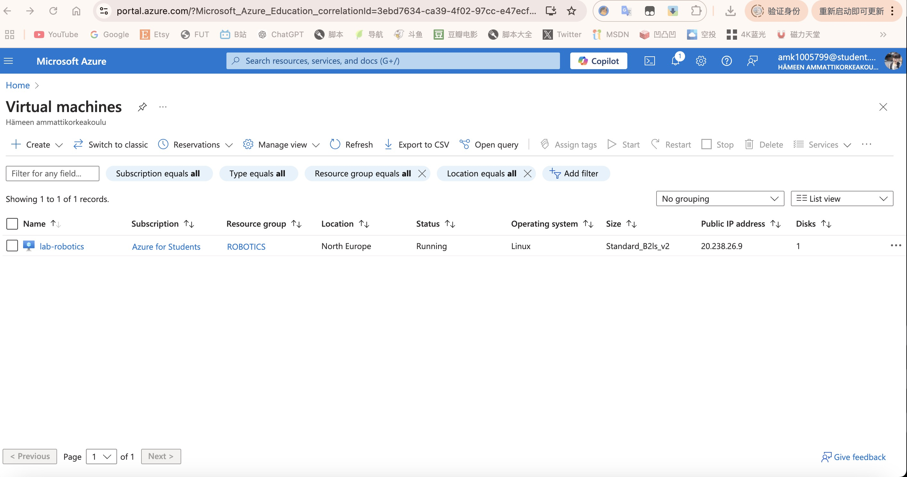
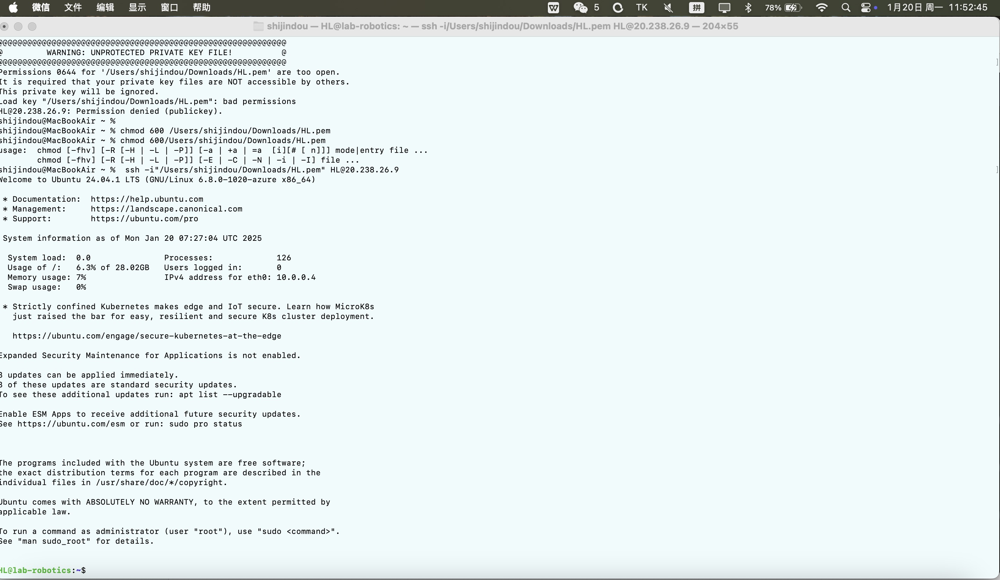
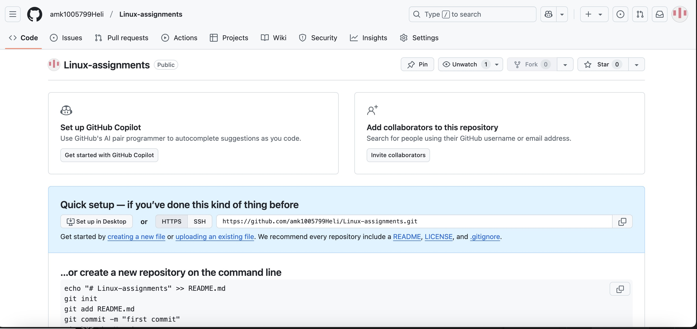

       # linux-assignments homework Heli
         20.01.2025
       
       First, I created a new virtual machine on this website according to the course content
       
    > First, I created a new virtual machine on this website（https://portal.azure.com/#home） according to the course.
    > Next,a virtual machine, with the following settings: 
      1.select Marketplace from Ubuntu Server 24.04 LTS gen 2 Server published by Canonical. 
      2.Name your machine logically. E.g. Ubuntu1-tja-NEur-B1s 
      3.Set the machine virtual machine size to Standard_B2ls_v2. 
      4.Specify the public ip to which you allow SSH traffic 
      5.Create yourself either a username and ssh key or an ID and password. 
      6.Create a new resource group for the machine and a subnet to place the machine in  
    >  After the setup is completed and the operation is successful 

    >  Log in in the terminal using the downloaded key
       The correct format is ssh -i"/Users/shijindou/Downloads/HL.pem" HL@20.238.26.9
      
    >Finally, open GitHub and complete Create a repository for Linux assignments

      

     

