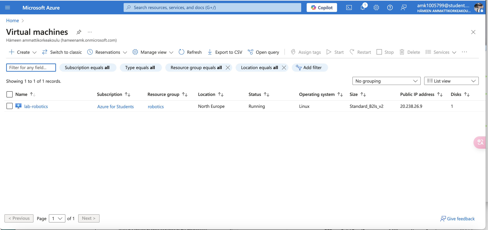

       # linux-assignments Assingment 3 Heli
         30.01.2025
       
       
       
    First, Run the virtual machine and log in to the terminal 

  

    > 1.Create the Tupu user using the adduser script
 
  : 
      2.Create lupu and check its path
 

       3.Create hupu and check if you cannot log in

       4.Create and check to add users Tupu and Lupu to the sudo user

       5.Create the projekti group and the /opt/projekti directory. Modify the directory's group. Add Tupu and Lupu to the projekti group, set permissions, and verify.

      

     

